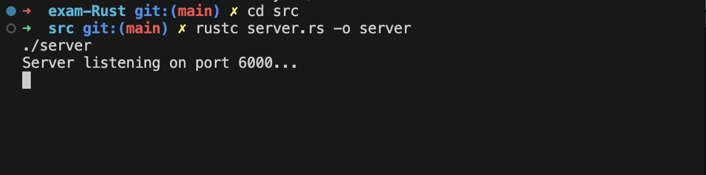
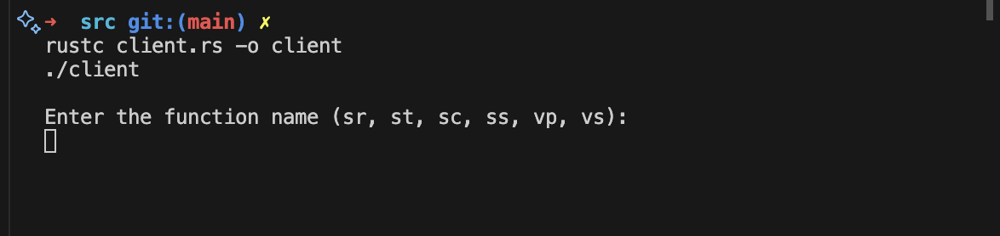
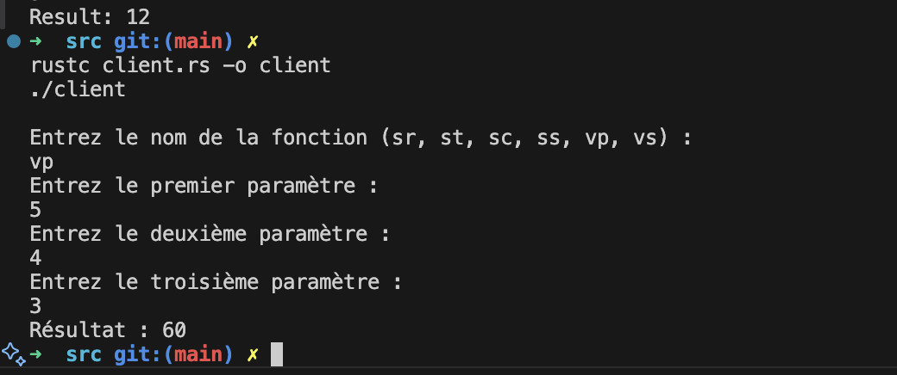
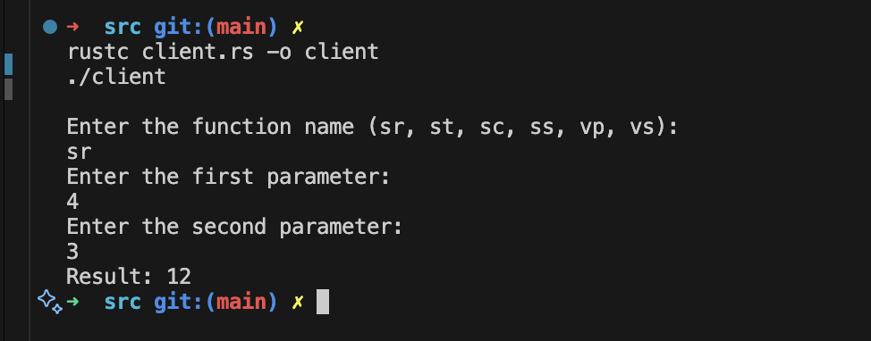

# Milia LAHOUAZI

## Exercice 03
### positionnez vous dans le repertoire src puis : 
### Compilez et exécutez le serveur :

`rustc server.rs -o server
./server`

### Compilez et exécutez le client dans un autre terminal :

`rustc client.rs -o client 
./client`

- Ensuite on peut choisir la fonction (sr, st, sc, ss,vp , vs) ainsi que les parametres (qui doivent etre des nombres positifs):

